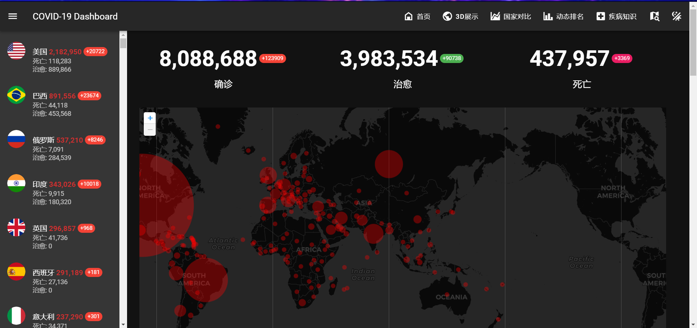

# COVID-19-Dashboard
新冠疫情数据可视化，包含世界地图，中国地图，3D地球，动态排名，支持省市级交互；

数据源：[霍普金斯大学数据](https://github.com/CSSEGISandData/COVID-19) - [世卫组织WHO](https://www.who.int/zh/emergencies/diseases/novel-coronavirus-2019/advice-for-public) - [丁香园实时数据](https://3g.dxy.cn/newh5/view/pneumonia) - [Covid Data](https://github.com/bumbeishvili/covid19-daily-data) - [腾讯新闻](https://news.qq.com/zt2020/page/feiyan.htm#/global) - [国旗图片](https://corona.lmao.ninja/) - [国家中英翻译](<https://github.com/TjFish/Random>) 

## Demo

看这里  <https://tjfish.github.io/COVID-19-Dashboard/#/>



## 参考项目

~~我是裁缝王，裁缝王就是我~~

- 首页 <https://github.com/sorxrob/2019-ncov-frontend>

- 3d地球 https://github.com/sorxrob/covid3d

- 国家对比 <https://github.com/trekhleb/covid-19>
- 动态排名 <https://github.com/Jannchie/Historical-ranking-data-visualization-based-on-d3.js>
- 中国地图 <https://github.com/xiuxiuing/ncov-map>

框架/组件：[Vuetify](https://vuetifyjs.com/en/) - [Apexchart](https://apexcharts.com/) - [Leaflet](https://leafletjs.com/) - [D3js](https://d3js.org/) - [Globe.gl](https://github.com/vasturiano/globe.gl)- [Material Design Icons](https://materialdesignicons.com/) - [Echart](<https://echarts.apache.org/>) - [bird](<https://bird.ioliu.cn/>)

## 给学弟学妹的建议（Web课）

⛔不要选功能性网站！不要选功能性网站！不要选功能性网站！（如个人博客，网上商城），被怼到怀疑人生

👀可以考虑3d游戏，数据可视化，炫酷网页，功能不要求多，重点就是**好看**，金爷爷喜欢

👼优秀学长项目

- 3D魔方 <https://github.com/pancerZH/I-cannot-deal-with-Rubiks-cube>
- 探索太空 <https://github.com/AzureLeon1/Explore-Space>
- 宫崎骏电影小站 <http://106.15.194.220:1217>
- 个人博客 <https://github.com/hlr7999/MyBlog> （纯手撸强强强，~~答辩80分反面教材~~）
- WebFPS ——Unity 制作 <https://maninroad.github.io/MyWebFPS/>
- Unity导出WebGl了解一下？<https://learn.unity.com/tutorial/fps-mod-weapon-parameters>

拿良不难，有成品基本就行，拿优看选题和运气

## Q & A

**Q: Demo网页连接打不开，加载很久？**

A: 由于部分数据来自国外，需要VPN才能访问


**Q: 项目很好，我想继续开发，有什么建议吗？**

A: 不要继续开发


**Q: 金👴答辩有什么要注意的吗？**

A: 只答不辨，问就道歉; 

老师说的都对，是我没考虑清楚; 


**Q: 金爷爷答辩被怼的好惨，咋办？**

A: 建议心态放轻松, 往年来看被怼也不一定拿良，有时候金爷爷很喜欢你的项目，也会怼你。另外金老师只给70%分数，还有助教捞你一手。


## Run it

运行项目前，需要先安装npm，由于nodejs自带npm，所以直接安装[nodejs](https://nodejs.org/zh-cn/) 即可。

下载源代码后，项目分为两个子项目

- Dashboard

```powershell
# 工作目录
cd Dashboard 
# 安装依赖
npm install 
# 启动server
npm run server 
```

​	open browser  http://localhost:8080/

- 3d

```powershell
cd 3d
npm install 
npm run dev
```

​	open browser http://localhost:1234/

**最后，本项目代码混乱，赶工明显，不建议继续开发。谨希望能为学弟学妹们提供一些思路~~**

**祝好！**


